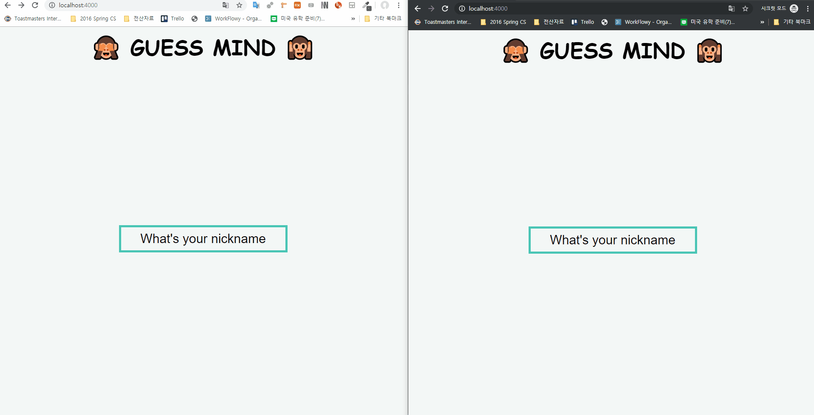

# guess-mind

## Demo 

## Description
Clonning catch mind game.  
Realtime Drawing build with socketIO, Gulp and Node  
캐치 마인드게임을 클로닝한 프로젝트입니다.  
socketIO와 Gulp를 공부하기 위해 진행했습니다.  

## How to execute the project
1. Download the project folder
2. npm install
3. npm run dev:server
4. npm run dev:assets

## What I used
- Server
    - ExpressJs
- UI
    - Pug
    - SCSS
- Communication between Client and Sever
    - SocketIO
- Bundler: gulp
